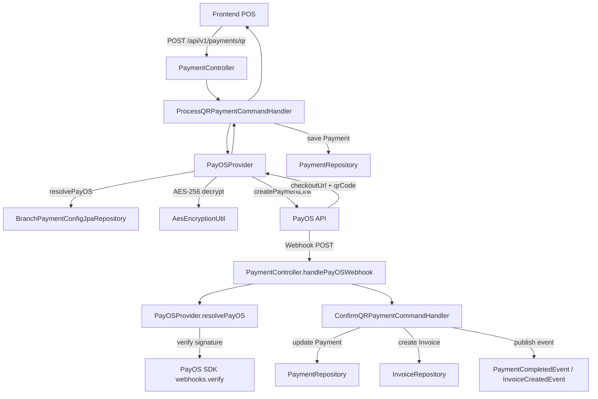
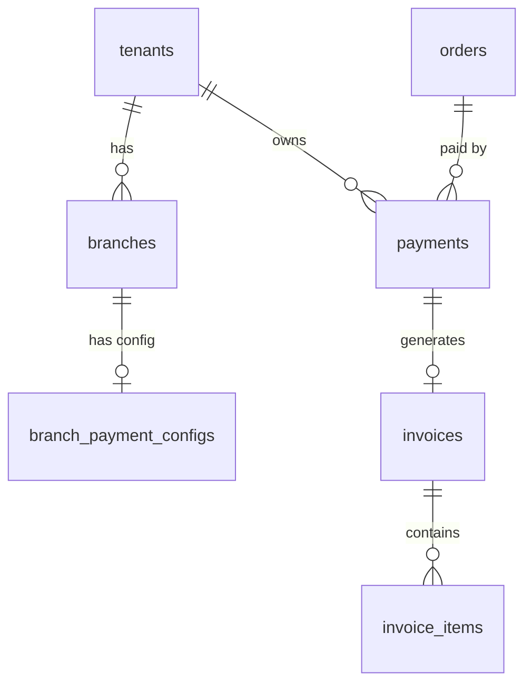

# Tài Liệu Kỹ Thuật: Tích Hợp PayOS — SmartFnB Backend

> **Phiên bản:** 1.0 · **Ngày:** 28-04-2026 · **Tác giả:** Hoàng

---

## 1. TỔNG QUAN HỆ THỐNG

### 1.1 PayOS là gì?

PayOS là cổng thanh toán trực tuyến cho phép merchant tạo QR code chuẩn VietQR. Khách hàng quét QR bằng **bất kỳ app ngân hàng nào** để thanh toán. SmartFnB dùng PayOS để hỗ trợ thanh toán QR tại quầy POS.

### 1.2 Sơ đồ kiến trúc



### 1.3 Dependencies (pom.xml)

```xml
<!-- PayOS Java SDK 2.0.1 -->
<dependency>
    <groupId>vn.payos</groupId>
    <artifactId>payos-java</artifactId>
    <version>2.0.1</version>
</dependency>
```

**Các package SDK được sử dụng:**
- `vn.payos.PayOS` — client chính
- `vn.payos.model.v2.paymentRequests.*` — CreatePaymentLinkRequest, CreatePaymentLinkResponse, PaymentLink, PaymentLinkItem
- `vn.payos.model.webhooks.Webhook`, `WebhookData` — xử lý webhook

---

## 2. CẤU HÌNH & KHỞI TẠO

### 2.1 Biến môi trường (application.yml)

```yaml
payos:
  client-id: ${PAYOS_CLIENT_ID:your-client-id}
  api-key: ${PAYOS_API_KEY:your-api-key}
  checksum-key: ${PAYOS_CHECKSUM_KEY:your-checksum-key}
  encryption:
    secret-key: ${PAYOS_ENCRYPTION_KEY:c21hcnRmbmItZGV2LXBheW9zLWtleS0yMDI2ISEhISE=}
  return-url: ${PAYOS_RETURN_URL:http://localhost:5173/pos/payment?result=success}
  cancel-url: ${PAYOS_CANCEL_URL:http://localhost:5173/pos/payment?result=cancel}
```

### 2.2 Giải thích Config Keys

| Key | Nguồn | Mô tả |
|-----|-------|-------|
| `PAYOS_CLIENT_ID` | dashboard.payos.vn | Định danh merchant, lưu plaintext trong DB |
| `PAYOS_API_KEY` | dashboard.payos.vn | Key gọi API, **mã hoá AES-256** trước khi lưu DB |
| `PAYOS_CHECKSUM_KEY` | dashboard.payos.vn | Key verify webhook HMAC, **mã hoá AES-256** trước khi lưu DB |
| `PAYOS_ENCRYPTION_KEY` | `openssl rand -base64 32` | Master key AES-256 để encrypt/decrypt apiKey + checksumKey |
| `PAYOS_RETURN_URL` | Tự cấu hình | URL FE redirect khi thanh toán thành công |
| `PAYOS_CANCEL_URL` | Tự cấu hình | URL FE redirect khi huỷ thanh toán |

### 2.3 Khởi tạo PayOS — Per-Branch (Multi-tenant)

> **Quan trọng:** Hệ thống **KHÔNG** dùng global PayOS bean. Mỗi chi nhánh có bộ credentials riêng, lưu mã hoá trong bảng `branch_payment_configs`.

**File:** `PayOSConfig.java` — Bean `@Bean` đã bị **comment `// @Bean`**, chỉ giữ cho backward compatibility.

**File:** `PayOSProvider.java` — method `resolvePayOS()`:

```java
public PayOS resolvePayOS(UUID tenantId, UUID branchId) throws Exception {
    // 1. Validate tenantId, branchId không null
    // 2. Query DB: branch_payment_configs WHERE branchId AND tenantId
    // 3. Check config.isActive()
    // 4. Decrypt AES-256: apiKey, checksumKey
    // 5. return new PayOS(clientId, apiKey, checksumKey)
}
```

### 2.4 Mã hoá AES-256-CBC

**File:** `AesEncryptionUtil.java`

- **Thuật toán:** AES/CBC/PKCS5Padding
- **IV:** 16 bytes ngẫu nhiên mỗi lần encrypt
- **Lưu trữ:** `Base64(IV || ciphertext)`
- **Secret key:** 32 bytes từ `PAYOS_ENCRYPTION_KEY` (Base64-decoded)

---

## 3. LUỒNG TẠO ĐƠN HÀNG & SINH QR

### Bước 1 — Nhận request từ client

**Endpoint:** `POST /api/v1/payments/qr`

**Auth:** JWT + `PAYMENT_CREATE` hoặc role `CASHIER/BRANCH_MANAGER/OWNER/SUPER_ADMIN`

**Request Body** (`ProcessQRPaymentRequest`):
```json
{
  "orderId": "uuid",
  "amount": 150000.00,
  "qrMethod": "PAYOS"
}
```

| Field | Type | Required | Validation |
|-------|------|----------|------------|
| orderId | UUID | Bắt buộc | @NotNull |
| amount | BigDecimal | Bắt buộc | @NotNull, max 12 integer + 2 decimal |
| qrMethod | String | Bắt buộc | @NotBlank, phải là VIETQR/MOMO/PAYOS |

### Bước 2 — Xử lý business logic

**File:** `ProcessQRPaymentCommandHandler.handle()`

1. **Validate QR method** — parse string thành `PaymentMethod` enum, check hợp lệ
2. **Fetch Order** qua `OrderAdapter.getOrderById()`
3. **Check amount** — `amount >= order.totalAmount`
4. **Check order status** — không cho thanh toán order COMPLETED/CANCELLED
5. **Check duplicate** — `paymentRepository.findByOrderId()` — nếu đã COMPLETED thì throw
6. **Tạo Payment** — `Payment.createQRPayment()` với `status=PENDING`, `qrExpiresAt = now + 180s`
7. **Save Payment** lần 1 (lấy paymentId)
8. **Gọi QR Provider** — `PayOSProvider.generateQRCode()`
9. **Lưu transactionId** — `payment.attachGatewayTransaction(paymentLinkId)` — save lần 2

### Bước 3 — Gọi PayOS API

**File:** `PayOSProvider.generateQRCode()`

**Sinh orderCode:**
```java
long orderCode = Math.abs(paymentId.getMostSignificantBits() % 10_000_000_000L);
if (orderCode == 0) orderCode = 1;
```

**Build payload:**
```java
CreatePaymentLinkRequest.builder()
    .orderCode(orderCode)
    .amount(amountValue)
    .description("TT " + orderNumber)  // max 25 ký tự, tự truncate
    .item(PaymentLinkItem)
    .returnUrl(returnUrl)
    .cancelUrl(cancelUrl)
    .expiredAt(Instant.now().plusSeconds(180).getEpochSecond())
    .build();
```

**Gọi SDK:**
```java
PayOS payOS = resolvePayOS(); // per-branch credentials
CreatePaymentLinkResponse response = payOS.paymentRequests().create(paymentData);
```

### Bước 4 — Trả về client

**Response** (`ProcessQRPaymentResponse`):
```json
{
  "paymentId": "uuid",
  "qrCodeUrl": "https://pay.payos.vn/web/...",
  "qrCodeData": "raw-qr-string",
  "expiresInSeconds": 180,
  "orderNumber": "ORD-001"
}
```

---

## 4. LUỒNG XÁC NHẬN THANH TOÁN

### 4.1 Webhook Flow (Production)

#### Bước 1 — Nhận Webhook từ PayOS

**Endpoint:** `POST /api/v1/payments/qr/webhook/payos`  
**Auth:** Không cần JWT — permitAll() trong `SecurityConfig.java`

#### Bước 2 — Xác thực chữ ký

**File:** `PaymentController.handlePayOSWebhook()`

1. Đọc `paymentLinkId` từ `webhook.getData()`
2. Tìm Payment trong DB theo `transactionId = paymentLinkId`
3. Lấy Order để biết `branchId`
4. Resolve PayOS instance đúng bộ key của chi nhánh:
```java
WebhookData webhookData = payOSProvider
    .resolvePayOS(payment.getTenantId(), order.branchId())
    .webhooks().verify(webhook);
```
5. SDK throw Exception nếu signature không hợp lệ → trả 400

#### Bước 3 — Xử lý kết quả

**File:** `ConfirmQRPaymentCommandHandler.handle()`

| PayOS code | Internal status | Hành động |
|-----------|----------------|-----------|
| `"00"` | success | markCompleted → tạo Invoice → publish events |
| Khác | failed | markFailed |

**Khi success:** markCompleted (allowExpiredQr=true) → tạo Invoice → completeOrder → publish PaymentCompletedEvent + InvoiceCreatedEvent

**Khi failed/expired:** markFailed → save, không tạo Invoice

#### Bước 4 — Response trả PayOS

Luôn trả HTTP 200 để PayOS không retry.

### 4.2 Polling Flow (Local/Dev)

**Endpoint:** `POST /api/v1/payments/{paymentId}/sync-status`  
**File:** `SyncQRPaymentStatusCommandHandler` — gọi `provider.checkPaymentStatus()` rồi delegate sang `ConfirmQRPaymentCommandHandler`.

---

## 5. XỬ LÝ LỖI & TRƯỜNG HỢP ĐẶC BIỆT

### 5.1 Idempotency

```java
// ConfirmQRPaymentCommandHandler dòng 61-65
if (payment.isCompleted()) {
    log.info("QR Payment đã hoàn tất trước đó, bỏ qua...");
    return;
}
```

### 5.2 QR hết hạn nhưng gateway đã PAID

Gateway là nguồn sự thật → `payment.markCompleted(transactionId, allowExpiredQr=true)`

### 5.3 Custom Exceptions

| Error Code | HTTP | Mô tả |
|-----------|------|-------|
| PAYOS_CONFIG_MISSING | 400 | Chi nhánh chưa cấu hình PayOS |
| PAYOS_CONFIG_INACTIVE | 400 | Config bị tắt |
| PAYOS_ERROR | 502 | Lỗi gọi PayOS API |
| PAYMENT_AMOUNT_MISMATCH | 400 | Số tiền webhook không khớp |
| PAYMENT_ALREADY_COMPLETED | 400 | Đơn đã thanh toán |

---

## 6. DATA MODEL

### 6.1 Bảng `payments`

| Column | Type | Mô tả |
|--------|------|-------|
| id | UUID PK | ID nội bộ |
| tenant_id | UUID FK | Tenant sở hữu |
| order_id | UUID FK | Đơn hàng |
| amount | DECIMAL(12,2) | Số tiền |
| method | VARCHAR(20) | CASH/VIETQR/MOMO/ZALOPAY/**PAYOS** |
| status | VARCHAR(20) | PENDING/COMPLETED/FAILED/CANCELLED/REFUNDED |
| transaction_id | VARCHAR(255) | **paymentLinkId từ PayOS** |
| qr_expires_at | TIMESTAMP | now() + 180s |
| paid_at | TIMESTAMP | Thời điểm thanh toán |

### 6.2 Bảng `branch_payment_configs`

| Column | Type | Mô tả |
|--------|------|-------|
| id | UUID PK | |
| branch_id | UUID FK | Chi nhánh |
| tenant_id | UUID FK | Tenant |
| client_id | VARCHAR(255) | PayOS Client ID (plaintext) |
| api_key_encrypted | TEXT | API Key mã hoá AES-256 |
| checksum_key_encrypted | TEXT | Checksum Key mã hoá AES-256 |
| is_active | BOOLEAN | Bật/tắt |

### 6.3 Diagram quan hệ



---

## 7. API REFERENCE

### 7.1 Tạo QR Payment

`POST /api/v1/payments/qr` (JWT required)

Request:
```json
{ "orderId": "uuid", "amount": 150000.00, "qrMethod": "PAYOS" }
```

Response 201:
```json
{
  "success": true,
  "data": {
    "paymentId": "uuid",
    "qrCodeUrl": "https://pay.payos.vn/web/abc123",
    "qrCodeData": "00020101021...",
    "expiresInSeconds": 180,
    "orderNumber": "ORD-001"
  }
}
```

### 7.2 Sync Status (Polling)

`POST /api/v1/payments/{paymentId}/sync-status` (JWT required)

### 7.3 PayOS Webhook

`POST /api/v1/payments/qr/webhook/payos` (No Auth)

### 7.4 Manual Confirm

`POST /api/v1/payments/{paymentId}/confirm` (JWT required)

### 7.5 Config PayOS per-branch

`GET /api/v1/branches/{branchId}/payment-config` (JWT + BRANCH_EDIT)  
`PUT /api/v1/branches/{branchId}/payment-config` (JWT + BRANCH_EDIT)

PUT Request:
```json
{ "clientId": "abc123", "apiKey": "sk_live_xxxx", "checksumKey": "ck_live_xxxx" }
```

---

## 8. HƯỚNG DẪN CHO DEVELOPER

### 8.1 Test local

1. Tạo tài khoản test tại dashboard.payos.vn
2. Cấu hình credentials qua `PUT /api/v1/branches/{branchId}/payment-config`
3. Dùng polling `POST /payments/{paymentId}/sync-status` thay webhook
4. Production: đăng ký webhook URL trên dashboard PayOS

### 8.2 Lỗi thường gặp

| Lỗi | Fix |
|-----|-----|
| PAYOS_CONFIG_MISSING | Vào Settings nhập API key |
| Description > 25 ký tự | Code đã tự truncate |
| Webhook 400 signature | Kiểm tra config chi nhánh |

### 8.3 Checklist

- [ ] Dùng `resolvePayOS()` per-branch (KHÔNG dùng global bean)
- [ ] Mã hoá AES trước khi lưu API key vào DB
- [ ] Response KHÔNG trả raw key (phải mask)
- [ ] Webhook endpoint permitAll() trong SecurityConfig
- [ ] Handle idempotency (payment đã COMPLETED)
- [ ] Trả HTTP 200 cho PayOS sau khi xử lý webhook
- [ ] Set/clear TenantContext đúng trong luồng webhook

### 8.4 Anti-patterns

1. **PayOSConfig bean bị comment** — `@Bean` comment thành `// @Bean`. Không uncomment.
2. **cancelQRCode() bị comment** — Cần implement lại nếu muốn cho cashier huỷ QR.
3. **Không có retry logic** — PayOS API timeout chỉ throw 502, không retry.
