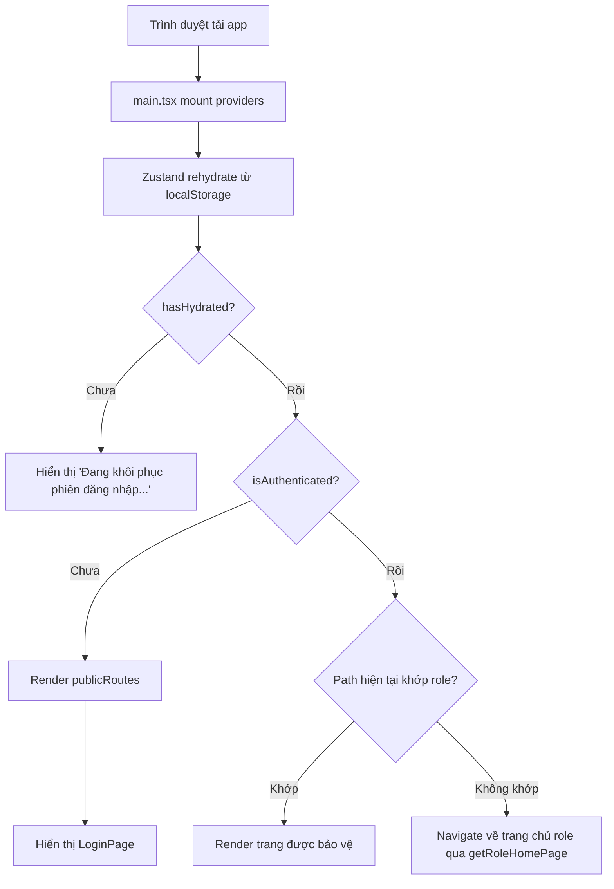
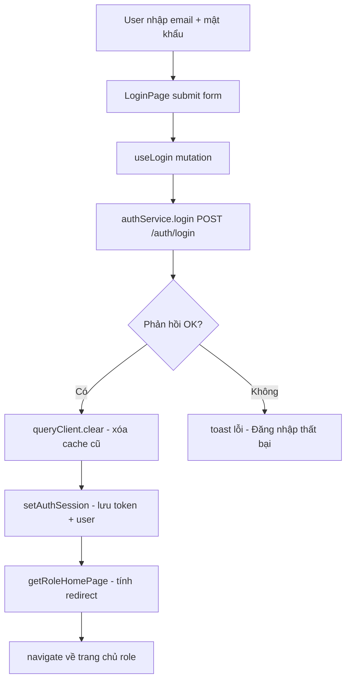
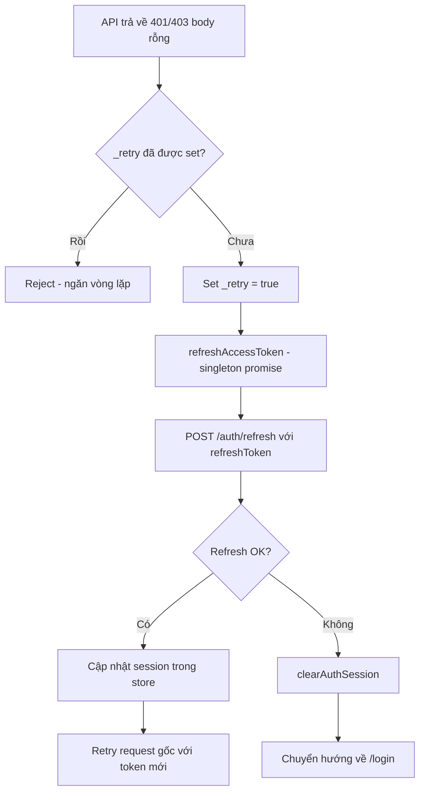
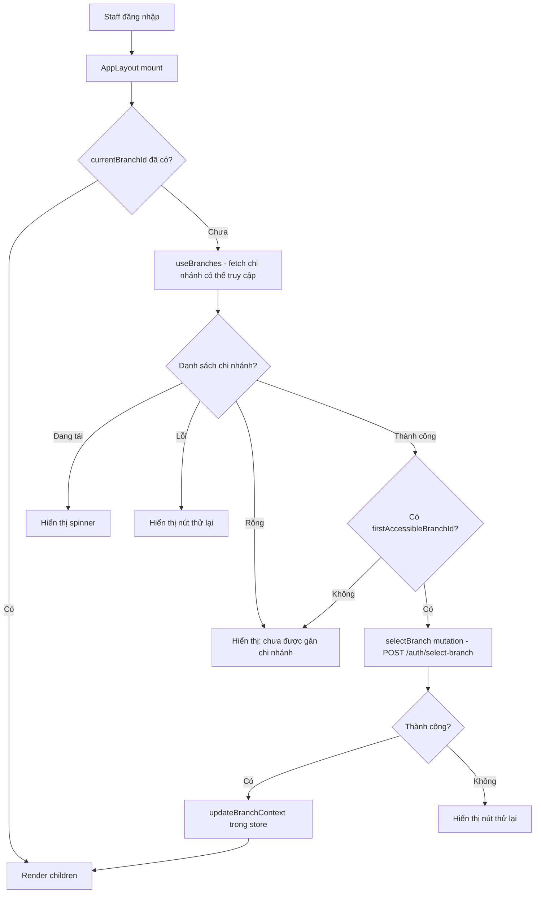
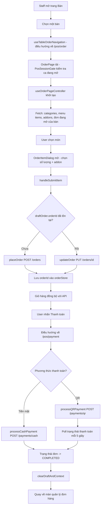
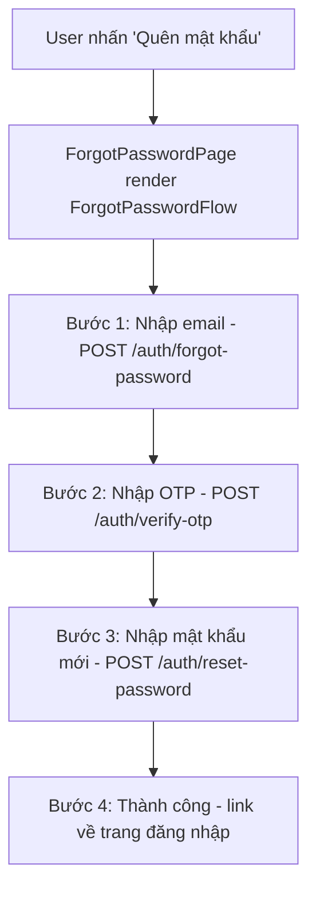
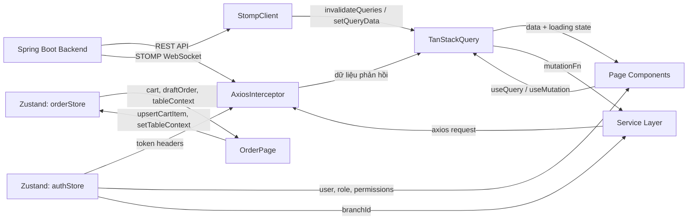

# SmartF&B Frontend — Tài Liệu Review & Kiểm Tra Toàn Diện

> **Phiên bản:** 1.0
> **Ngày:** 2026-05-05
> **Tác giả:** AI Agent (Review theo góc nhìn Senior Frontend Engineer)
> **Codebase:** `smartfb-frontend` — React 19 + TypeScript + Vite

---

## Mục Lục

1. [Tổng Quan Dự Án](#1-tổng-quan-dự-án)
2. [Phân Tích Component](#2-phân-tích-component)
3. [Luồng Hoạt Động (User Journeys)](#3-luồng-hoạt-động-user-journeys)
4. [Bản Đồ UI / Màn Hình](#4-bản-đồ-ui--màn-hình)
5. [Luồng Dữ Liệu & Quản Lý State](#5-luồng-dữ-liệu--quản-lý-state)
6. [Tích Hợp API](#6-tích-hợp-api)
7. [Chất Lượng Code & Các Vấn Đề Phát Hiện](#7-chất-lượng-code--các-vấn-đề-phát-hiện)
8. [Tổng Kết](#8-tổng-kết)

---

## 1. Tổng Quan Dự Án

### 1.1 Tên Dự Án & Mục Đích

**SmartF&B** là nền tảng SaaS POS (Point-of-Sale) đa tenant dành cho quản lý chuỗi quán cafe và nhà hàng. Frontend phục vụ ba nhóm vai trò người dùng:

| Vai trò | Mô tả | Namespace route |
|---------|-------|-----------------|
| `ADMIN` | Super-admin quản lý tenant, gói dịch vụ, billing của hệ thống SaaS | `/admin/*` |
| `OWNER` | Chủ quán quản lý chuỗi cửa hàng của mình | `/owner/*` |
| `STAFF` | Thu ngân / barista / phục vụ / branch_manager | `/pos/*` |

### 1.2 Tech Stack

| Hạng mục | Công nghệ | Phiên bản |
|----------|-----------|-----------|
| Framework | React | 19.2.4 |
| Ngôn ngữ | TypeScript (strict mode) | 5.9.3 |
| Build tool | Vite | 8.0.1 |
| Routing | React Router DOM | 7.13.2 |
| Server state | TanStack Query | 5.95.2 |
| Global state | Zustand | 5.0.12 |
| Form | React Hook Form | 7.72.0 |
| Validation | Zod | 4.3.6 |
| HTTP client | Axios | 1.13.6 |
| Realtime | STOMP over SockJS (`@stomp/stompjs` + `sockjs-client`) | 7.3.0 / 1.6.1 |
| UI components | shadcn/ui + Radix UI | — |
| Styling | Tailwind CSS | 4.2.2 |
| Charts | Recharts | 3.8.1 |
| Animation | Motion (Framer Motion v12) | 12.38.0 |
| Icons | Lucide React | 1.7.0 |
| Toast | React Hot Toast | 2.6.0 |

### 1.3 Cấu Trúc Thư Mục

```
src/
├── App.tsx                  # Component gốc — khởi tạo cây route
├── main.tsx                 # Entry point — bọc app trong các provider
│
├── routes/                  # Cấu hình route + guard
│   ├── routeConfig.tsx      # Toàn bộ định nghĩa route (lazy import, phân quyền)
│   ├── ProtectedRoute.tsx   # Guard theo role + permission cho route yêu cầu xác thực
│   └── PublicRoute.tsx      # Chuyển hướng user đã đăng nhập khỏi trang auth
│
├── layouts/                 # Layout wrapper
│   ├── AppLayout.tsx        # Shell dùng chung cho Owner/Staff (chọn chi nhánh, auto-select cho staff)
│   ├── AdminLayout.tsx      # Shell chỉ dành cho Admin
│   └── index.ts
│
├── pages/                   # Page-level component (default export để dùng với React.lazy)
│   ├── auth/                # LoginPage, ForgotPasswordPage, RegisterPage
│   ├── admin/               # AdminDashboardPage, AdminPlansPage, AdminTenantsPage, AdminBillingPage
│   ├── owner/               # ~25 trang: Dashboard, Branches, Staff, Menu, Inventory, v.v.
│   ├── pos/                 # OrderPage, PaymentPage, OrderManagementPage, OrderDetailPage, MyShiftsPage
│   └── shared/              # ExpensesPage (Owner + Staff dùng chung)
│
├── modules/                 # Module nghiệp vụ — mỗi module tự chứa hoàn toàn
│   ├── auth/                # Đăng nhập, đăng ký, quên mật khẩu, OTP, chọn chi nhánh
│   ├── account/             # Quản lý hồ sơ người dùng
│   ├── branch/              # CRUD chi nhánh, bộ lọc, xem chi tiết
│   ├── menu/                # Danh mục sản phẩm, danh mục, addon
│   ├── recipe/              # Công thức nguyên liệu cho từng món
│   ├── inventory/           # Tồn kho, nhập kho, điều chỉnh, hao hụt, mẻ sản xuất
│   ├── order/               # Tạo đơn POS, giỏ hàng, quản lý trạng thái, realtime
│   ├── payment/             # Thanh toán tiền mặt/QR, quản lý hóa đơn
│   ├── pos-session/         # Mở/đóng ca POS, cổng kiểm tra ca
│   ├── staff/               # CRUD nhân viên, phân vai trò, ma trận quyền
│   ├── shift/               # Ca mẫu, lịch làm việc, ca của tôi
│   ├── table/               # Quản lý bàn và khu vực
│   ├── supplier/            # Nhà cung cấp & đơn mua hàng
│   ├── voucher/             # Quản lý voucher/khuyến mãi
│   ├── expense/             # Quản lý chi phí (phiếu chi vận hành)
│   ├── report/              # Báo cáo doanh thu, kho, nhân sự
│   ├── forecast/            # Dự báo tồn kho AI (NeuralProphet)
│   ├── finance/             # Nội dung quản lý tài chính
│   └── subscription/        # Gói đăng ký dịch vụ của tenant
│
├── shared/                  # Tiện ích dùng chung giữa các module
│   ├── components/
│   │   ├── ui/              # shadcn/ui components (KHÔNG sửa trực tiếp)
│   │   ├── layout/          # OwnerLayout, StaffLayout, Sidebar, Header
│   │   └── common/          # DataTable, StatusBadge, ConfirmDialog, PageWrapper, v.v.
│   ├── hooks/               # usePermission, useToast, useDebounce, v.v.
│   ├── utils/               # formatVND, formatDate, cn, getRoleHomePage, accessControl
│   ├── constants/           # ROLES, ROUTES, PERMISSIONS, queryKeys
│   └── types/               # ApiResponse<T>, PaginatedResult<T>
│
├── lib/                     # Cấu hình thư viện
│   ├── axios.ts             # Các Axios instance + interceptor xác thực + refresh token
│   ├── queryClient.ts       # Cấu hình TanStack Query client
│   ├── socket.ts            # STOMP/SockJS singleton client
│   └── aiClient.ts          # Axios instance cho AI microservice
│
├── providers/               # React context providers (bọc trong main.tsx)
└── utils/                   # Tiện ích cấp cao (vd: autoFixBranchId.ts)
```

---

## 2. Phân Tích Component

### 2.1 `App.tsx` — Shell Route

**Mục đích:** Component gốc của ứng dụng. Chờ Zustand auth store rehydrate từ localStorage, sau đó khởi tạo toàn bộ cây route.

**State:**
| Biến | Nguồn | Vai trò |
|------|-------|---------|
| `hasHydrated` | `useAuthStore` | Chặn render cho đến khi auth đã được khôi phục từ localStorage |
| `isAuthenticated` | `useAuthStore` | Xác định route fallback khi chuyển hướng |
| `currentRole` | `useAuthStore` | Dùng bởi `renderProtectedRoutes` để phân vùng theo role |
| `permissions` | `useAuthStore` | Truyền vào `getRoleHomePage` để redirect đúng trang theo quyền |

**Các hàm chính:**
- `renderProtectedRoutes(routes, allowedRoles, layout)` — ánh xạ mảng route config thành các phần tử `<Route>` được bọc trong `<ProtectedRoute>` + Layout tương ứng.
- `renderPosRouteElement(route)` — bọc các route POS trong `AppLayout` mà không lặp lại logic layout.
- `withRouteSuspense(element)` — bọc bất kỳ element lazy-load nào trong `<Suspense>` với fallback tiếng Việt.

**Kết quả render:** `<Routes>` chứa public routes, admin routes (AdminLayout), owner routes (AppLayout), staff routes (AppLayout), POS routes (AppLayout + PosSessionGate tùy chọn), và wildcard `Navigate` fallback.

---

### 2.2 `routes/routeConfig.tsx` — Định Nghĩa Route

**Mục đích:** Tập trung hóa toàn bộ định nghĩa route. Dùng `React.lazy` để code-split từng trang. Cung cấp 5 mảng route: `publicRoutes`, `adminRoutes`, `ownerRoutes`, `staffRoutes`, `posRoutes`.

**Các pattern chính:**
- `createRoute(path, pageTitle, element, accessRequirement?)` — helper tạo object `RouteConfigItem`.
- `createPlaceholderRoute(...)` — tạo route render `<PagePlaceholder>` cho các trang chưa triển khai.
- Route có phân quyền dùng `requiredPermissions: STAFF_ROUTE_PERMISSIONS.XXX` để giới hạn truy cập của staff.

---

### 2.3 `routes/ProtectedRoute.tsx` — Guard Route

**Mục đích:** Bọc các route yêu cầu xác thực. Chuyển hướng user chưa đăng nhập về `/login`, user sai role về trang chủ của role đó.

**Props:**
| Prop | Kiểu | Mô tả |
|------|------|-------|
| `children` | `ReactNode` | Trang sẽ render nếu được phép truy cập |
| `allowedRoles?` | `Role[]` | Chỉ các role này mới được truy cập route |
| `requiredPermissions?` | `readonly string[]` | Staff phải có ít nhất một quyền khớp trong danh sách |

**Logic:**
1. Chưa xác thực → chuyển hướng về `/login` (giữ `location.state.from` để redirect-back).
2. Role không nằm trong `allowedRoles` → chuyển hướng về trang chủ của role.
3. `hasAccess()` trả về false → chuyển hướng về trang chủ (hoặc hiển thị placeholder để tránh redirect vô hạn).

---

### 2.4 `layouts/AppLayout.tsx` — Shell Owner/Staff

**Mục đích:** Layout dùng chung cho tất cả trang sau đăng nhập. Xử lý tự động chọn chi nhánh cho staff.

**Props:**
| Prop | Kiểu | Mô tả |
|------|------|-------|
| `children` | `ReactNode` | Nội dung trang |
| `pageTitle` | `string` | Truyền vào `<PageMeta>` và header của layout |

**State:**
| Biến | Vai trò |
|------|---------|
| `currentBranchId` | Chi nhánh đang active trong auth store |
| `autoSelectedBranchIdRef` | Ref ngăn trigger auto-select lặp lại |
| `branches` / `branchOptions` | Danh sách chi nhánh có thể truy cập từ API |
| `selectedBranchId` | Computed: `currentBranchId ?? 'all'` (owner) hoặc `firstAccessibleBranchId` (staff) |

**Side Effects:**
- `useEffect` #1: Theo dõi thay đổi `currentBranchId` vào `autoSelectedBranchIdRef`.
- `useEffect` #2: Tự động chọn chi nhánh đầu tiên cho staff nếu `currentBranchId` là null. Gọi `selectBranch(firstAccessibleBranchId)` → gọi `POST /auth/select-branch` → cập nhật JWT + store.

**Các hàm chính:**
- `handleBranchChange(branchId)` — owner chuyển chi nhánh; gọi `selectBranch()` hoặc reset về "all" + invalidate cache.
- `handleRetryAutoSelect()` — nút thử lại cho staff khi auto-select thất bại.
- IIFE `staffContent` — trả về `StaffBranchSetupState` phù hợp hoặc children dựa theo các trạng thái loading/error/null-branch.

**Kết quả render:** Render `<OwnerLayout>` hoặc `<StaffLayout>` (từ `@shared/components/layout`), truyền danh sách chi nhánh và handler chọn chi nhánh.

---

### 2.5 `lib/axios.ts` — HTTP Client

**Mục đích:** Tạo hai Axios instance và gắn interceptor xác thực/retry vào instance chính.

**Các instance:**
| Instance | Trường hợp sử dụng |
|----------|--------------------|
| `publicAxiosInstance` | Endpoint auth (login, register, refresh) — không có auth header |
| `axiosInstance` (default export) | Toàn bộ API nghiệp vụ — có interceptor xác thực |

**Request Interceptor** (trên `axiosInstance`):
1. Đọc `accessToken`, `tenantId`, `branchId` từ Zustand auth store.
2. Gắn header `Authorization: Bearer <token>`, `X-Tenant-Id`, `X-Branch-Id`.
3. Xóa `Content-Type` với payload `FormData` (để browser tự set multipart boundary).

**Response Interceptor** (trên `axiosInstance`):
1. Khi gặp 401 hoặc 403 không có body: gọi `refreshAccessToken()` (singleton promise tránh refresh đồng thời).
2. Refresh thành công: retry request gốc với token mới (cờ `_retry` tránh vòng lặp vô hạn).
3. Refresh thất bại: xóa auth store, hiển thị toast, chuyển hướng về `/login`.
4. Ánh xạ HTTP status (400, 403, 404, 409, 500, 503) thành thông báo toast tiếng Việt.

---

### 2.6 `lib/socket.ts` — WebSocket (STOMP) Client

**Mục đích:** Quản lý singleton STOMP client qua SockJS để giao tiếp realtime với backend Spring WebSocket.

**Các hàm chính:**
- `getStompClient()` — tạo và kích hoạt client nếu chưa có; gắn header `Authorization` trong `beforeConnect`.
- `stompSubscribe(topic, callback)` — subscribe topic; xử lý subscribe trì hoãn nếu chưa kết nối.
- `disconnectStomp()` — ngắt kết nối client và xóa singleton (gọi khi logout).

**Cấu hình:**
- `WS_URL`: từ biến môi trường `VITE_WS_URL` hoặc mặc định `/ws`.
- Tự động reconnect: sau 5 giây.

---

### 2.7 `modules/auth/stores/authStore.ts` — Auth Store

**Mục đích:** Store Zustand trung tâm cho trạng thái xác thực. Được persist xuống `localStorage`.

**Cấu trúc State:**
| Field | Kiểu | Mô tả |
|-------|------|-------|
| `user` | `AuthUser \| null` | Được suy ra từ session + profile; không persist trực tiếp |
| `profile` | `AuthProfile \| null` | Thông tin hiển thị (email, fullName, phone); được persist |
| `session` | `AuthSession \| null` | Token + claims (role, permissions, tenantId, branchId); được persist |
| `isAuthenticated` | `boolean` | Suy ra: true khi session tồn tại |
| `hasHydrated` | `boolean` | True sau khi Zustand rehydrate từ localStorage |

**Actions:**
| Action | Mô tả |
|--------|-------|
| `setAuthSession(response, context)` | Gọi sau login/refresh; xây dựng lại session, profile, user |
| `clearAuthSession()` | Đăng xuất — reset toàn bộ auth state về null |
| `updateUser(updates)` | Cập nhật một phần profile người dùng |
| `updateBranchContext(branchId)` | Cập nhật `user.branchId` và `session.branchId` khi đổi chi nhánh |
| `setHydrated(value)` | Gọi bởi `onRehydrateStorage` của Zustand để báo hiệu hydration xong |

**Persistence:**
- Chỉ `profile` và `session` được persist (qua `partialize`).
- `user` luôn được suy ra tại runtime từ `session + profile` để tránh lưu dữ liệu trùng.

---

### 2.8 `modules/order/stores/orderStore.ts` — Order/Cart Store

**Mục đích:** Store Zustand in-memory cho luồng đặt hàng POS. Không persist (source of truth là API).

**State:**
| Field | Kiểu | Mô tả |
|-------|------|-------|
| `cart` | `OrderDraftItem[]` | Các món đang được thêm vào đơn |
| `orders` | `OrderListItemResponse[]` | Danh sách cache từ `fetchOrders()` (legacy, phần lớn đã được TanStack Query thay thế) |
| `tableContext` | `OrderTableContext \| null` | Thông tin bàn + khu vực + chi nhánh của đơn đang tạo |
| `draftOrder` | `DraftOrderMeta` | orderId, orderNumber, status, createdAt của đơn đang xử lý |
| `isLoading` | `boolean` | Cờ loading của `fetchOrders()` |
| `isSyncingDraft` | `boolean` | True khi đang đồng bộ draft với API (place/update order) |

**Các hàm chính:**
- `setTableContext(context)` — chuyển bàn active; reset cart và draft nếu bàn thay đổi.
- `upsertCartItem(item)` — thêm hoặc cập nhật một món theo `draftItemId`.
- `removeFromCart(draftItemId)` — xóa một món khỏi giỏ.
- `clearDraftAndContext()` — reset hoàn toàn sau khi đơn hoàn thành.
- `updateOrderStatus(orderId, status)` — cập nhật trạng thái trong danh sách local (dùng cùng với realtime invalidation).

---

### 2.9 `modules/order/hooks/useOrderRealtime.ts` — WebSocket Hook

**Mục đích:** Subscribe topic `/topic/orders/{branchId}` qua STOMP để nhận cập nhật đơn hàng theo thời gian thực.

**Side Effect:**
Khi `branchId` thay đổi:
1. Subscribe vào STOMP topic theo chi nhánh.
2. Khi nhận được message:
   - Invalidate `queryKeys.orders.lists` → trigger refetch danh sách đơn.
   - `setQueryData` cho `queryKeys.orders.detail(order.id)` → cập nhật một phần (status, totalAmount, items).
   - Nếu `order.tableId` tồn tại → invalidate `queryKeys.orders.activeByTable(tableId)`.
3. Khi unmount → `subscription.unsubscribe()`.

---

### 2.10 `shared/hooks/usePermission.ts` — Permission Hook

**Mục đích:** Cung cấp kiểm tra phân quyền theo role và permission cho các UI component.

**Trả về:**
| Field | Kiểu | Mô tả |
|-------|------|-------|
| `userRole` | `Role` | Role hiện tại của user |
| `permissions` | `string[]` | Các mã quyền từ JWT session |
| `isAdmin` | `boolean` | Role === ADMIN |
| `isOwner` | `boolean` | Role === OWNER |
| `isStaff` | `boolean` | Role === STAFF |
| `can(permission)` | `(p: string) => boolean` | Admin/Owner bypass tất cả; Staff phải có quyền tường minh |

---

### 2.11 `pages/pos/OrderPage.tsx` — Trang Đặt Món POS

**Mục đích:** Màn hình đặt món POS chính. Render lưới menu, sidebar giỏ hàng và xử lý toàn bộ vòng đời đơn hàng.

**State:**
| Biến | Vai trò |
|------|---------|
| `showCart` | Bật/tắt hiển thị sidebar giỏ hàng trên desktop |
| `isCartSheetOpen` | Điều khiển cart sheet trên mobile |

**Dữ liệu qua `useOrderPageController()`:**
Toàn bộ logic nghiệp vụ được ủy thác cho hook controller này, trả về:
- Dữ liệu menu: `categories`, `filteredItems`, `addons`
- Trạng thái giỏ: `cart`, `subtotal`, `vatAmount`, `totalAmount`, `totalItemCount`
- Trạng thái đơn: `draftOrder`, `tableContext`, `hasPlacedOrder`, `isSyncingDraft`, `isPlacedOrderFinalized`
- Handler: `handleCheckout`, `handleSubmitItem`, `handleEditCartItem`, `handleDeleteCartItem`, `handleCancelPlacedOrder`, `handleOpenInvoice`

**Kết quả render:**
- Grid 2 cột (menu + giỏ) trên màn xl; 1 cột trên mobile.
- `OrderPageToolbar` → tìm kiếm + bật/tắt giỏ.
- `OrderCategoryTabs` → lọc món theo danh mục.
- `OrderMenuGrid` → lưới card món.
- `OrderPageCartSidebar` → giỏ hàng desktop (ẩn trên mobile).
- `OrderItemDialog` → modal chọn số lượng + addon.
- `TemporaryInvoiceDialog` → xem trước hóa đơn tạm trước khi thanh toán.

---

### 2.12 `modules/inventory/services/inventoryService.ts` — Inventory Service

**Mục đích:** Service toàn diện xử lý tồn kho, danh mục item, thao tác kho và mẻ sản xuất.

**Các pattern đáng chú ý:**
- `fetchAllPages<T>(url, params)` — fetch nhận biết phân trang, lấy tất cả trang từ backend Spring (dùng `totalPages`).
- `mapInventoryBalance()` + `mapProductionBatch()` — hàm chuyển đổi response (chuẩn hóa kiểu số từ sự mơ hồ string/number của backend).
- `buildCatalogTypeMap()` — tạo `Map<itemId, type>` để phân biệt INGREDIENT và SUB_ASSEMBLY trong bảng tồn kho.

---

## 3. Luồng Hoạt Động (User Journeys)

### 3.1 Luồng Khởi Động Ứng Dụng



### 3.2 Luồng Xác Thực (Đăng Nhập)



### 3.3 Luồng Refresh Token



### 3.4 Luồng Tự Động Chọn Chi Nhánh Cho Staff



### 3.5 Luồng Đặt Món POS



### 3.6 Luồng Quên Mật Khẩu



---

## 4. Bản Đồ UI / Màn Hình

### 4.1 Tất Cả Trang & Route

| Route | Trang | Role | Mô tả |
|-------|-------|------|-------|
| `/login` | LoginPage | Public | Đăng nhập bằng email + mật khẩu |
| `/register` | RegisterPage | Public | Đăng ký tenant mới |
| `/forgot-password` | ForgotPasswordPage | Public | Đặt lại mật khẩu 4 bước qua OTP |
| `/admin` | AdminDashboardPage | ADMIN | Tổng quan hệ thống, chỉ số |
| `/admin/plans` | AdminPlansPage | ADMIN | Quản lý gói dịch vụ |
| `/admin/tenants` | AdminTenantsPage | ADMIN | Quản lý toàn bộ tenant |
| `/admin/billing` | AdminBillingPage | ADMIN | Quản lý billing & hóa đơn |
| `/owner/dashboard` | DashboardPage | OWNER | Tổng quan doanh thu, biểu đồ |
| `/owner/tables` | TablesPage | OWNER | Quản lý bàn & khu vực |
| `/owner/menu` | MenuPage | OWNER | Quản lý danh mục sản phẩm |
| `/owner/inventory` | InventoryPage | OWNER | Tồn kho, nhập kho, hao hụt |
| `/owner/inventory/ai-forecast` | AiForecastPage | OWNER | Dự báo nhu cầu bằng AI |
| `/owner/recipes` | RecipesPage | OWNER | Công thức nguyên liệu theo món |
| `/owner/staff` | StaffPage | OWNER | Quản lý danh sách nhân viên |
| `/owner/staff/new` | CreateStaffPage | OWNER | Tạo nhân viên mới |
| `/owner/staff/:id` | StaffDetailPage | OWNER | Chi tiết nhân viên + ca làm |
| `/owner/staff/positions` | StaffPositionsPage | OWNER | Chức vụ + ma trận phân quyền |
| `/owner/schedules` | ShiftManagementPage | OWNER | Quản lý ca mẫu |
| `/owner/schedules/:id` | ShiftTemplateDetailPage | OWNER | Chi tiết ca mẫu |
| `/owner/branches` | BranchesPage | OWNER | Danh sách chi nhánh |
| `/owner/branches/new` | CreateBranchPage | OWNER | Tạo chi nhánh mới |
| `/owner/branches/:id` | BranchDetailPage | OWNER | Chi tiết chi nhánh + nhật ký hoạt động |
| `/owner/promotions` | VouchersPage | OWNER | Quản lý voucher/khuyến mãi |
| `/owner/pos-sessions` | PosSessionHistoryPage | OWNER | Lịch sử ca POS |
| `/owner/suppliers` | SuppliersPage | OWNER | Danh sách nhà cung cấp |
| `/owner/suppliers/:id` | SupplierDetailPage | OWNER | Chi tiết nhà cung cấp + đơn mua |
| `/owner/reports/revenue` | RevenuePage | OWNER | Báo cáo doanh thu + biểu đồ |
| `/owner/reports/inventory` | InventoryReportPage | OWNER | Báo cáo kho |
| `/owner/reports/hr` | HrReportPage | OWNER | Báo cáo nhân sự (lương, chấm công) |
| `/owner/settings` | SettingsPage | OWNER | Cài đặt tài khoản + chi nhánh |
| `/owner/packages` | PackagesPage | OWNER | Gói dịch vụ đăng ký |
| `/owner/expenses` | ExpensesPage | OWNER/STAFF | Quản lý chi phí |
| `/pos/order` | OrderPage | OWNER/STAFF | Tạo đơn POS |
| `/pos/payment` | PaymentPage | OWNER/STAFF | Xử lý thanh toán |
| `/pos/management` | OrderManagementPage | OWNER/STAFF | Danh sách + trạng thái đơn hàng |
| `/pos/orders/:orderId` | OrderDetailPage | OWNER/STAFF | Xem chi tiết đơn hàng |
| `/pos/my-shifts` | MyShiftsPage | STAFF | Xem lịch ca cá nhân |

### 4.2 Sơ Đồ Điều Hướng Màn Hình

```mermaid
graph LR
    Login --> OwnerDash[Dashboard Owner]
    Login --> StaffTables[Staff: Bàn]

    OwnerDash --> Tables[Bàn]
    OwnerDash --> Menu[Thực đơn]
    OwnerDash --> Inventory[Kho]
    OwnerDash --> Staff[Nhân viên]
    OwnerDash --> Branches[Chi nhánh]
    OwnerDash --> Suppliers[Nhà cung cấp]
    OwnerDash --> Vouchers[Voucher]
    OwnerDash --> Reports[Báo cáo]
    OwnerDash --> Schedules[Ca làm việc]

    Tables --> PosOrder[/pos/order]
    PosOrder --> Payment[/pos/payment]
    Payment --> OrderMgmt[/pos/management]
    OrderMgmt --> OrderDetail[/pos/orders/:id]

    Staff --> StaffDetail[/owner/staff/:id]
    Staff --> CreateStaff[/owner/staff/new]
    Staff --> Positions[/owner/staff/positions]

    Branches --> CreateBranch[/owner/branches/new]
    Branches --> BranchDetail[/owner/branches/:id]

    Suppliers --> SupplierDetail[/owner/suppliers/:id]

    Inventory --> AiForecast[/owner/inventory/ai-forecast]
    Inventory --> Recipes[/owner/recipes]

    Reports --> Revenue[/owner/reports/revenue]
    Reports --> InventoryReport[/owner/reports/inventory]
    Reports --> HRReport[/owner/reports/hr]

    Schedules --> ShiftDetail[/owner/schedules/:id]
```

---

## 5. Luồng Dữ Liệu & Quản Lý State

### 5.1 Tổng Quan Kiến Trúc State

Ứng dụng phân chia rõ ràng các loại state:

| Loại state | Công nghệ | Ví dụ |
|------------|-----------|-------|
| Auth / branch context | Zustand (persist) | User, token, branchId, permissions |
| Giỏ hàng / POS runtime | Zustand (in-memory) | Cart items, draft order, table context |
| Server state | TanStack Query | Chi nhánh, đơn hàng, thực đơn, báo cáo |
| Form state | React Hook Form | Tất cả form (tạo nhân viên, menu, chi nhánh, v.v.) |

### 5.2 Sơ Đồ Luồng Dữ Liệu



### 5.3 Các Zustand Store

#### authStore (Được persist)

```
authStore {
  user: AuthUser | null          ← suy ra từ session + profile
  profile: AuthProfile | null    ← persist: email, fullName, phone
  session: AuthSession | null    ← persist: accessToken, refreshToken, role, permissions, tenantId, branchId
  isAuthenticated: boolean
  hasHydrated: boolean
}
```

#### orderStore (In-memory)

```
orderStore {
  cart: OrderDraftItem[]         ← các món đang đặt
  tableContext: OrderTableContext ← bàn + khu vực + chi nhánh đang active
  draftOrder: DraftOrderMeta     ← orderId, orderNumber, status
  isSyncingDraft: boolean        ← đang đồng bộ với API
}
```

### 5.4 Phân Loại TanStack Query Key

Toàn bộ query key được định nghĩa tập trung tại `src/shared/constants/queryKeys.ts` theo factory pattern:

```
queryKeys.orders.lists              → ['orders', 'list']           (invalidate toàn bộ danh sách đơn)
queryKeys.orders.list(filters)      → ['orders', 'list', filters]  (danh sách theo bộ lọc cụ thể)
queryKeys.orders.detail(id)         → ['orders', 'detail', id]     (một đơn hàng)
queryKeys.orders.activeByTable(tid) → ['orders', 'active', 'table', tableId]

queryKeys.branches.all              → ['branches']
queryKeys.menu.list(filters)        → ['menu', 'list', filters]
queryKeys.inventory.balances.list() → ['inventory', 'balances', 'list', filters]
queryKeys.forecast.detail(branchId) → ['ai-forecast', 'detail', branchId]
```

**staleTime mặc định:** 5 phút (cấu hình trong `queryClient.ts`).

---

## 6. Tích Hợp API

### 6.1 Cấu Hình Chung

- **Base URL:** biến môi trường `VITE_API_BASE_URL` hoặc `/api/v1` (proxy qua Vite/Nginx)
- **WebSocket URL:** biến môi trường `VITE_WS_URL` hoặc `/ws`
- **Timeout:** 30,000 ms
- **Header auth:** `Authorization: Bearer <token>`, `X-Tenant-Id`, `X-Branch-Id`

### 6.2 Endpoint Xác Thực

| Method | Endpoint | Payload | Response | Dùng ở |
|--------|----------|---------|----------|--------|
| POST | `/auth/login` | `{ email, password }` | `ApiResponse<BackendAuthResponse>` | `useLogin` |
| POST | `/auth/register` | `{ email, password, fullName, phone, tenantName }` | `ApiResponse<BackendAuthResponse>` | `useRegister` |
| POST | `/auth/refresh` | `{ refreshToken? }` | `ApiResponse<BackendAuthResponse>` | Axios interceptor |
| POST | `/auth/forgot-password` | `{ email }` | `ApiResponse<void>` | `useForgotPassword` |
| POST | `/auth/verify-otp` | `{ email, otp }` | `ApiResponse<VerifyOtpResponse>` | `useVerifyOtp` |
| POST | `/auth/reset-password` | `{ email, otp, newPassword }` | `ApiResponse<void>` | `useResetPassword` |
| POST | `/auth/select-branch` | `{ branchId }` | `ApiResponse<BackendAuthResponse>` | `useSelectBranch` |

### 6.3 Endpoint Chi Nhánh

| Method | Endpoint | Payload | Response | Dùng ở |
|--------|----------|---------|----------|--------|
| GET | `/branches` | — | `ApiResponse<Branch[]>` | `useBranches` |
| POST | `/branches` | `CreateBranchPayload` | `ApiResponse<Branch>` | `useCreateBranch` |
| PUT | `/branches/:id` | `UpdateBranchPayload` | `ApiResponse<Branch>` | `useEditBranch` |
| DELETE | `/branches/:id` | — | `ApiResponse<void>` | Vô hiệu hóa chi nhánh |
| GET | `/branches/:id/payment-config` | — | `ApiResponse<PaymentGatewayConfig>` | Trang cài đặt |
| PUT | `/branches/:id/payment-config` | `PaymentGatewayConfigPayload` | `ApiResponse<PaymentGatewayConfig>` | Trang cài đặt |
| POST | `/branches/:id/users` | `{ userId }` | `ApiResponse<void>` | Gán nhân viên vào chi nhánh |

### 6.4 Endpoint Đơn Hàng

| Method | Endpoint | Payload | Response | Dùng ở |
|--------|----------|---------|----------|--------|
| POST | `/orders` | `PlaceOrderRequest` | `OrderApiResponse` | `orderService.placeOrder` |
| GET | `/orders` | Query params (status, from, to, page, size) | `ApiResponse<OrderListPageResponse>` | `orderService.getOrderPage` |
| GET | `/orders/:id` | — | `OrderApiResponse` | `useOrderDetail` |
| PUT | `/orders/:id` | `UpdateOrderRequest` | `OrderApiResponse` | `orderService.updateOrder` |
| PUT | `/orders/:id/status` | `{ newStatus, reason? }` | `OrderApiResponse` | `orderService.updateStatus` |
| POST | `/orders/:id/cancel` | `{ reason? }` | `OrderApiResponse` | `orderService.cancelOrder` |

### 6.5 Endpoint Thanh Toán

| Method | Endpoint | Payload | Response | Dùng ở |
|--------|----------|---------|----------|--------|
| POST | `/payments/cash` | `ProcessCashPaymentRequest` | `ProcessCashPaymentApiResponse` | `useProcessCashPayment` |
| POST | `/payments/qr` | `ProcessQRPaymentRequest` | `ProcessQRPaymentApiResponse` | `useProcessQRPayment` |
| POST | `/payments/:id/confirm` | — | void | Xác nhận QR thủ công |
| GET | `/payments/invoices` | Search params | `SearchInvoiceApiResponse` | Quản lý hóa đơn |
| GET | `/payments/invoices/:id` | — | `InvoiceApiResponse` | Chi tiết hóa đơn |
| GET | `/payments/:id` | — | `PaymentApiResponse` | Poll trạng thái thanh toán |
| POST | `/payments/:id/sync-status` | — | `PaymentApiResponse` | Đồng bộ trạng thái QR |

### 6.6 Endpoint Kho Hàng

| Method | Endpoint | Payload | Response | Dùng ở |
|--------|----------|---------|----------|--------|
| GET | `/inventory` | `{ page, size }` | `ApiResponse<PageResponse<InventoryBalance>>` | `inventoryService.getList` |
| GET | `/menu/items` | `{ type, page, size }` | `ApiResponse<PageResponse<CatalogItem>>` | Lấy danh mục |
| POST | `/inventory/import` | `ImportStockPayload` | `ApiResponse<string>` | Nhập kho |
| POST | `/inventory/adjust` | `AdjustStockPayload` | `ApiResponse<void>` | Điều chỉnh tồn kho |
| POST | `/inventory/waste` | `WasteRecordPayload` | `ApiResponse<void>` | Ghi nhận hao hụt |
| POST | `/inventory/production-batches` | `RecordProductionBatchPayload` | `ApiResponse<string>` | Mẻ sản xuất |
| PATCH | `/inventory/balances/:id/threshold` | `{ minLevel }` | `ApiResponse<void>` | Cập nhật mức tồn tối thiểu |
| GET | `/inventory/transactions` | Filter + pagination | `ApiResponse<PageResponse<Transaction>>` | Lịch sử giao dịch |
| GET | `/inventory/production-batches` | Pagination | `ApiResponse<PageResponse<ProductionBatch>>` | Lịch sử mẻ sản xuất |

### 6.7 Endpoint Thực Đơn

| Method | Endpoint | Mô tả |
|--------|----------|-------|
| GET | `/menu/items` | Danh sách món (lọc theo type, danh mục, chi nhánh) |
| POST | `/menu/items` | Tạo món mới |
| PUT | `/menu/items/:id` | Cập nhật món |
| DELETE | `/menu/items/:id` | Xóa món |
| PATCH | `/menu/items/:id/status` | Bật/tắt trạng thái phục vụ |
| GET | `/menu/categories` | Danh sách danh mục |
| POST | `/menu/categories` | Tạo danh mục |
| PUT | `/menu/categories/:id` | Cập nhật danh mục |
| DELETE | `/menu/categories/:id` | Xóa danh mục |
| GET | `/menu/addons` | Danh sách addon (topping) |
| POST | `/menu/addons` | Tạo addon |
| PUT | `/menu/addons/:id` | Cập nhật addon |
| DELETE | `/menu/addons/:id` | Xóa addon |

### 6.8 Endpoint Các Module Khác

| Module | Base Path | Các thao tác chính |
|--------|-----------|-------------------|
| Nhân viên | `/staff` | CRUD, bật/tắt trạng thái, lọc theo chi nhánh |
| Chức vụ | `/positions` | Danh sách, tạo, cập nhật |
| Vai trò | `/roles` | Đọc/ghi ma trận quyền |
| Bàn | `/tables`, `/table-zones` | CRUD khu vực và bàn |
| Nhà cung cấp | `/suppliers`, `/purchase-orders` | CRUD nhà cung cấp, đơn mua hàng |
| Voucher | `/vouchers` | CRUD, kích hoạt/vô hiệu hóa |
| Chi phí | `/financial-invoices` | CRUD phiếu chi vận hành |
| Ca POS | `/pos-sessions` | Mở/đóng ca, lịch sử, breakdown doanh thu |
| Ca làm việc | `/shift-templates`, `/shift-schedules` | CRUD ca mẫu, quản lý lịch |
| Báo cáo | `/reports/revenue`, `/reports/hr`, `/reports/inventory` | Endpoint phân tích |
| Dự báo AI | (AI service riêng qua `aiClient.ts`) | Dự báo, train model, trạng thái train |
| Đăng ký | `/subscriptions`, `/plans` | Danh sách gói, đăng ký hiện tại |

### 6.9 Topic WebSocket

| Topic | Sự kiện trigger | Handler |
|-------|-----------------|---------|
| `/topic/orders/{branchId}` | Bất kỳ thay đổi trạng thái đơn nào trong chi nhánh | `useOrderRealtime` — invalidate danh sách đơn + cập nhật cache chi tiết |

---

## 7. Chất Lượng Code & Các Vấn Đề Phát Hiện

### 7.1 Bug: Logic Điều Kiện Sai Trong Axios Response Interceptor

**File:** `src/lib/axios.ts:164`

**Vấn đề:** Điều kiện trigger refresh token bị lỗi độ ưu tiên toán tử logic:
```typescript
// Hiện tại (BUG): đánh giá như (401) HOẶC (403 VÀ !body)
if (
  (error.response?.status === 401 || error.response?.status === 403 && !error.response?.data) &&
  ...
```

**Đúng phải là:**
```typescript
// Đúng: bọc điều kiện 403 trong ngoặc
if (
  (error.response?.status === 401 || (error.response?.status === 403 && !error.response?.data)) &&
  ...
```

**Ảnh hưởng:** Một lỗi 403 Forbidden thực sự (có body) có thể bị xử lý sai thành refresh token, che giấu lỗi phân quyền thành lỗi hết phiên.

---

### 7.2 Anti-Pattern: Logic Nghiệp Vụ Trong Zustand Store (`orderStore.ts`)

**File:** `src/modules/order/stores/orderStore.ts:157`

**Vấn đề:** `fetchOrders()` và `updateOrderStatus()` bên trong Zustand store gọi API trực tiếp (`orderService.getOrders()`) thay vì dùng TanStack Query.
```typescript
// Anti-pattern: gọi API trong Zustand
fetchOrders: async () => {
  const response = await orderService.getOrders();
  set({ orders: response.data });
},
```

**Ảnh hưởng:** Bỏ qua caching, stale time, background refetch và deduplication của TanStack Query. Tạo ra nguồn dữ liệu trùng lặp có thể không đồng bộ với `useOrders` (TanStack Query).

**Khuyến nghị:** Xóa `fetchOrders` và `updateOrderStatus` khỏi store. Thay bằng các TanStack hook `useOrders()` và `useUpdateOrderStatus()`. Mảng `orders` trong Zustand cũng nên được xóa.

---

### 7.3 Bug: `console.log` / `console.error` Còn Trong Code Production

**Các file:**
- `src/modules/order/stores/orderStore.ts:166` — `console.error('Không thể tải danh sách đơn hàng:', error)`
- `src/lib/socket.ts:32` — `console.info('[WS] STOMP kết nối thành công')`
- `src/lib/socket.ts:35` — `console.info('[WS] STOMP ngắt kết nối')`
- `src/modules/order/hooks/useOrderRealtime.ts:101` — `console.error('[WS] useOrderRealtime: parse lỗi', message.body)`

**Ảnh hưởng:** Rò rỉ thông tin debug nội bộ ra môi trường production. Nên dùng logger chuyên dụng hoặc xóa bỏ.

---

### 7.4 Không Nhất Quán: Export `QUERY_KEYS` vs `queryKeys`

**Vấn đề:** `src/shared/constants/queryKeys.ts` export `queryKeys` (chữ thường camelCase) nhưng quy ước trong CLAUDE.md tham chiếu `QUERY_KEYS` (chữ hoa). Một số hook import không đồng nhất.

**Ví dụ:**
- `useOrderRealtime.ts` import `{ queryKeys }` ✅
- Một số hook cũ có thể tham chiếu `QUERY_KEYS` không tồn tại → gây lỗi runtime nếu chưa cập nhật.

**Khuyến nghị:** Chuẩn hóa toàn bộ về `queryKeys` (đúng theo export thực tế).

---

### 7.5 Race Condition Tiềm Ẩn: Override `onConnect` Của STOMP

**File:** `src/lib/socket.ts:71`

**Vấn đề:** Khi nhiều hook gọi `stompSubscribe` trước khi client kết nối, mỗi hook ghi đè `client.onConnect`:
```typescript
const originalOnConnect = client.onConnect;
client.onConnect = (frame) => {
  originalOnConnect?.(frame);
  // subscribe ...
};
```

**Ảnh hưởng:** Nếu hai hook chạy đồng thời trước khi kết nối, `originalOnConnect` được capture là cùng một hàm gốc — chain hoạt động cho 2 hook nhưng các hook tiếp theo sẽ mất subscription.

**Khuyến nghị:** Dùng mảng listener thay vì ghi đè `onConnect`.

---

### 7.6 Hiệu Năng: `fetchAllPages` Khi Tải Kho Hàng

**File:** `src/modules/inventory/services/inventoryService.ts:85`

**Vấn đề:** `getList()` fetch toàn bộ trang tồn kho song song, cộng thêm 2 lần fetch catalog. Với tenant lớn, có thể có nhiều request đồng thời (3+ cuộc gọi song song, mỗi cuộc gồm nhiều trang).

**Ảnh hưởng:** Có thể gây tải đột biến backend với catalog lớn. Hằng số `INVENTORY_PAGE_SIZE = 100` giảm thiểu nhưng không loại trừ vấn đề.

**Khuyến nghị:** Triển khai lọc và phân trang phía server thay vì filter toàn bộ dataset phía client.

---

### 7.7 Code Thừa: Mảng `orders` Trong `orderStore`

**File:** `src/modules/order/stores/orderStore.ts`

**Vấn đề:** Field `orders: OrderListItemResponse[]` trong Zustand order store được populate bởi `fetchOrders()` nhưng danh sách đơn chính được quản lý bởi TanStack Query (`useOrders`). Tạo ra dead state chiếm bộ nhớ và gây nhầm lẫn cho người bảo trì.

---

### 7.8 Thiếu Cleanup: STOMP Client Khi Đăng Xuất

**Vấn đề:** Dù `disconnectStomp()` tồn tại trong `src/lib/socket.ts`, không có bằng chứng nó được gọi trong luồng đăng xuất (`clearAuthSession` trong authStore hoặc trong logout hook). Nếu STOMP client vẫn còn active sau đăng xuất, nó sẽ cố kết nối lại với JWT token cũ.

**Khuyến nghị:** Gọi `disconnectStomp()` trong handler `onSuccess` của logout mutation.

---

### 7.9 An Toàn Kiểu: Cast `unknown` Thành `WsOrderPayload`

**File:** `src/modules/order/hooks/useOrderRealtime.ts:63`

```typescript
const handleMessage = (payload: unknown) => {
  const order = payload as WsOrderPayload; // cast không an toàn
```

**Khuyến nghị:** Dùng schema Zod để parse và validate payload WebSocket tại runtime:
```typescript
const WsOrderPayloadSchema = z.object({ id: z.string(), status: z.string(), ... });
const result = WsOrderPayloadSchema.safeParse(payload);
if (!result.success) return;
const order = result.data;
```

---

### 7.10 Thiếu Error Boundary

**Vấn đề:** Không tìm thấy React Error Boundary nào trong codebase. Nếu một component ném lỗi trong quá trình render (vd: tham chiếu null không mong đợi trong xử lý dữ liệu phức tạp), toàn bộ app sẽ crash thành màn hình trắng.

**Khuyến nghị:** Thêm `<ErrorBoundary>` trong `main.tsx` bọc `<App>` và trong các page section quan trọng.

---

## 8. Tổng Kết

### 8.1 Nhận Xét Tổng Thể

SmartF&B Frontend là một ứng dụng SaaS POS đa tenant được thiết kế tốt, đạt chuẩn production. Bao phủ 13+ module chức năng (chi nhánh, nhân viên, thực đơn, kho, đơn hàng, thanh toán, báo cáo, AI dự báo, v.v.) và hỗ trợ ba vai trò người dùng riêng biệt với kiểm soát quyền chi tiết. Codebase tuân thủ nhất quán kiến trúc module theo tính năng với phân chia rõ ràng giữa UI, hooks, services, stores và types.

### 8.2 Điểm Mạnh Nổi Bật

| Điểm mạnh | Chi tiết |
|-----------|---------|
| **Kiến trúc** | Module theo tính năng, phân chia sạch (components / hooks / services / stores / types). Không có import chéo giữa các module. |
| **Thiết kế Auth** | Auth store tinh vi với partialize (tránh lưu trùng dữ liệu user), hỗ trợ migrate storage cũ, render nhận biết hydration. |
| **Refresh Token** | Singleton promise `refreshAccessToken()` ngăn refresh đồng thời. Refresh thất bại kích hoạt logout graceful. |
| **Realtime** | Tích hợp STOMP/SockJS với deferred subscription (xử lý cả trạng thái đã và chưa kết nối). Pattern cache invalidation sử dụng đúng `setQueryData` + `invalidateQueries` của TanStack Query. |
| **Multi-Tenant** | Header `X-Tenant-Id` và `X-Branch-Id` tự động inject bởi Axios interceptor từ auth store. |
| **Route Guards** | Kiểm soát truy cập 2 lớp: `ProtectedRoute` (role + permission) + `AppLayout` (cổng auto-select chi nhánh cho staff). |
| **Quản lý Query Key** | Factory-pattern query key tập trung ngăn lỗi đánh máy và cho phép cache invalidation chính xác. |
| **UX tiếng Việt** | Toàn bộ thông báo lỗi, toast và trạng thái loading đều bằng tiếng Việt — phù hợp thị trường mục tiêu. |
| **TypeScript Strict** | Sử dụng nhất quán interface cho tất cả props, payload service và store state. `any` không xuất hiện trong code path chính. |
| **Code Splitting** | Toàn bộ trang dùng `React.lazy` + `Suspense`, giữ bundle khởi tạo nhỏ gọn. |

### 8.3 Các Mục Cần Cải Thiện

| Mức độ | Vấn đề | File |
|--------|--------|------|
| **Cao** | Bug độ ưu tiên toán tử trong điều kiện refresh token 401/403 | `lib/axios.ts:164` |
| **Cao** | Zustand store gọi API trực tiếp (anti-pattern, bỏ qua TanStack Query) | `modules/order/stores/orderStore.ts` |
| **Cao** | Thiếu gọi `disconnectStomp()` khi đăng xuất | `lib/socket.ts`, logout hook |
| **Trung bình** | STOMP chain `onConnect` có thể mất subscription khi có 3+ caller trước khi kết nối | `lib/socket.ts:71` |
| **Trung bình** | Cast payload WebSocket không an toàn — nên dùng Zod parse | `modules/order/hooks/useOrderRealtime.ts:63` |
| **Trung bình** | Fetch toàn bộ trang kho phía client — cân nhắc phân trang phía server | `modules/inventory/services/inventoryService.ts` |
| **Trung bình** | Thiếu React Error Boundary — crash component = màn hình trắng | `main.tsx` |
| **Thấp** | `console.error`/`console.info` còn trong code production | `orderStore.ts`, `socket.ts`, `useOrderRealtime.ts` |
| **Thấp** | Mảng `orders` và `fetchOrders()` thừa trong Zustand order store | `modules/order/stores/orderStore.ts` |
| **Thấp** | Không nhất quán tên `QUERY_KEYS` vs `queryKeys` | `shared/constants/queryKeys.ts` |
